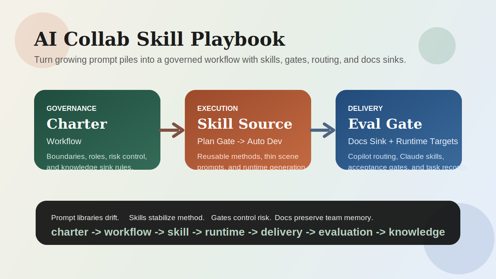

# AI Collab Skill Playbook

A public template for turning scattered prompts into a governed AI engineering workflow.



## What It Covers

- a charter that defines boundaries and control rules
- a workflow that translates the charter into execution stages
- reusable skills for planning, navigation, delivery, tracing, and evaluation
- generated runtime assets for GitHub Copilot and Claude-style local skills
- a docs sink pattern for `docs/tasks/` and `docs/knowledge-base/`

## Core Delivery Path

```text
plan-gate -> auto-dev -> evaluation-gate -> docs sink
```

## At A Glance

| Layer | Responsibility |
|---|---|
| Charter | Defines authority, boundaries, and risk rules |
| Workflow | Turns governance into a usable process |
| Skill | Encodes reusable working methods |
| Runtime | Generates Copilot and Claude-facing artifacts |
| Docs Sink | Preserves task outcomes and reusable knowledge |

## Key Ideas

1. Prompt is the task entry.
2. Skill is the reusable method.
3. Workflow is the controlled execution loop.
4. Charter is the top-level governance layer.
5. Completion requires evaluation and documentation, not just code changes.

## Why This Is More Than A Prompt Pack

- It keeps stable method in skills, not in ever-growing prompt files.
- It introduces explicit plan and evaluation gates.
- It treats documentation as part of delivery, not optional cleanup.
- It supports both GitHub Copilot and Claude-style runtime artifacts from one source.

## Start Here

1. [`template/docs/guides/AI协作试运行说明.md`](./template/docs/guides/AI协作试运行说明.md)
2. [`template/docs/guides/AI协作研发章程.md`](./template/docs/guides/AI协作研发章程.md)
3. [`template/docs/guides/ai-workflow.md`](./template/docs/guides/ai-workflow.md)
4. [`template/docs/skills-src/README.md`](./template/docs/skills-src/README.md)

## Template Highlights

- `template/docs/skills-src/`: source of truth
- `template/.claude/skills/`: generated Claude-style runtime skills
- `template/.github/`: generated Copilot instructions and prompt files
- `template/docs/prompts/`: compatibility entry layer
- `template/docs/tasks/`: task sink and templates

## Quick Trial

```bash
cd template
python3 docs/skills-src/tools/validate_skills.py
python3 docs/skills-src/tools/validate_copilot_assets.py
python3 docs/skills-src/tools/acceptance_check.py
```

## If You Want To Reuse It

Replace these first:

- `template/AGENTS.md`
- `template/docs/guides/AI协作研发章程.md`
- `template/docs/prompts/00-department-standards.md`
- `template/docs/skills-src/manifest.yaml`

Then regenerate:

```bash
cd template
python3 docs/skills-src/tools/generate_claude_skills.py
python3 docs/skills-src/tools/generate_copilot_assets.py
```

## Adoption Sequence

1. localize `AGENTS.md`
2. rewrite the charter
3. rewrite `00-department-standards.md`
4. adapt `manifest.yaml`
5. regenerate runtime targets
6. pilot with `plan-gate` before full `auto-dev`

## Public Release Notes

- [Repo structure](./docs/repo-structure.md)
- [Public sharing checklist](./docs/public-sharing-checklist.md)
- [Publish to GitHub](./docs/publish-to-github.md)
