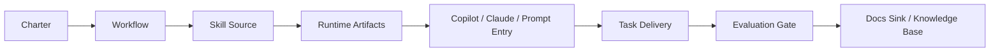

# AI Collab Skill Playbook

[](./LICENSE)
[](./template/)
[](./template/.github/)
[](./template/.claude/skills/)

[English](./README.en.md) | [简体中文](./README.zh-CN.md)

A public playbook for turning prompts into a governed AI development system with charters, workflows, reusable skills, Copilot routing, evaluation gates, and knowledge sinks.

这是一个把“几段 Prompt”升级成“团队可治理 AI 协作体系”的公开样板仓库，包含章程、工作流、Skill 源码、Copilot 适配、评测门禁和知识沉淀方法。

## Why This Repo Exists

Teams often hit the same ceiling when using AI for development:

- prompts keep growing, but behavior still drifts
- implementation happens before planning is confirmed
- code search degrades into noisy full-repo scanning
- results stay in chat history instead of becoming reusable knowledge
- “done” is declared before tests and evaluation gates are actually closed

This repo packages one practical answer:

`charter -> workflow -> skill -> tool entry -> docs sink`

## Architecture



## What You Get

- A governance layer for AI-assisted engineering
- A prompt-to-skill migration pattern
- A reusable `docs/skills-src/` structure
- Generated runtime targets for `.claude/skills/` and `.github/`
- A `plan-gate -> auto-dev -> evaluation-gate` delivery path
- A `docs/tasks/` and `docs/knowledge-base/` sink pattern

## Repo Layout

- [`docs/`](./docs/)
  Public-facing notes about structure, publishing, and sanitization.
- [`template/`](./template/)
  A copyable project template with:
  - [`template/AGENTS.md`](./template/AGENTS.md)
  - [`template/docs/guides/`](./template/docs/guides/)
  - [`template/docs/prompts/`](./template/docs/prompts/)
  - [`template/docs/skills-src/`](./template/docs/skills-src/)
  - [`template/.github/`](./template/.github/)
  - [`template/.claude/skills/`](./template/.claude/skills/)

## Read In This Order

1. [`template/docs/guides/AI协作试运行说明.md`](./template/docs/guides/AI协作试运行说明.md)
2. [`template/docs/guides/AI协作研发章程.md`](./template/docs/guides/AI协作研发章程.md)
3. [`template/docs/guides/ai-workflow.md`](./template/docs/guides/ai-workflow.md)
4. [`template/docs/prompts/README.md`](./template/docs/prompts/README.md)
5. [`template/docs/skills-src/README.md`](./template/docs/skills-src/README.md)

## Quick Start

```bash
cd template

python3 docs/skills-src/tools/validate_skills.py
python3 docs/skills-src/tools/validate_copilot_assets.py
python3 docs/skills-src/tools/generate_claude_skills.py
python3 docs/skills-src/tools/generate_copilot_assets.py
python3 docs/skills-src/tools/acceptance_check.py
```

## Best Fit

- Engineering teams moving from prompt collections to reusable AI workflows
- Teams using GitHub Copilot but wanting stronger governance and repeatability
- Teams experimenting with Claude-style local skills and runtime generation
- Multi-module or chain-heavy systems that need planning gates and knowledge sinks

## Public Sharing Notes

- Start with [`docs/public-sharing-checklist.md`](./docs/public-sharing-checklist.md)
- Then read [`docs/repo-structure.md`](./docs/repo-structure.md)
- Before pushing your own fork, read [`docs/publish-to-github.md`](./docs/publish-to-github.md)

## Language Guides

- [README.zh-CN.md](./README.zh-CN.md)
- [README.en.md](./README.en.md)

## Current Status

This is a public-first template, not a turnkey SaaS product.

The goal of v1 is simple:

- make the system understandable
- make the template copyable
- make the generated runtime artifacts reproducible
- make planning, delivery, evaluation, and docs sink visibly connected
