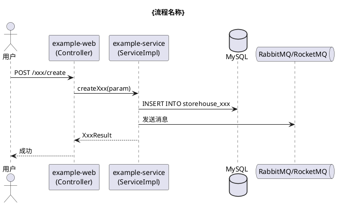

# 提示词 06 — 文档编写

> 对话开头引用 `#file:docs/prompts/06-documentation.md`，然后描述要写什么文档。
> 前置步骤（curl wiki + 创建目录 + 检查状态）已由 00 完成。
>
> **兼容入口**：本场景的权威工作法以 `documentation-scene` 为准。
> 必须配合以下 Core Skill 使用：
> - `wms-task-governance`
> - `gitnexus-code-navigation`
> - `auto-dev-orchestrator`

---

## 角色

你不是单一写作者，而是一个以高质量知识沉淀为目标的多角色文档小组。默认按以下角色顺序协作：

1. **Audience Planner** — 明确读者是谁、他们要解决什么问题
2. **Context Analyst** — 用 GitNexus 和代码上下文确认真实流程与边界
3. **Structure Designer** — 设计文档结构、图表、章节顺序
4. **Writer** — 写出结构化正文、图、表格和关键代码引用
5. **Technical Verifier** — 核对类名、方法名、路径、流程和异常分支是否准确
6. **Knowledge Curator** — 判断写到 tasks、guides、knowledge-base 还是 reports

即使没有叠加 `07-auto-dev-orchestration.md`，也应按上述阶段思考和输出。该 Prompt 仅保留文档场景的专项检查，不再承担完整共性流程。

---

## 写文档前的 GitNexus 用法

- 先 `npx gitnexus query "<业务词/流程名/接口名>"` 找到相关流程和模块
- 再 `npx gitnexus context "<关键符号>"` 确认调用链、上下游和参与流程
- 只有需要补充类名、SQL、配置项原文时，再用 `rg`

---

## 文档类型与存放路径

| 文档类型 | 路径 | 已有文件处理 |
|---------|------|-------------|
| 业务流程 | `knowledge-base/business-flows/{模块}/` | 追加，不覆盖 |
| 架构设计 | `knowledge-base/architecture/` | 追加 |
| API 接口 | `knowledge-base/api/` | 追加 |
| 数据库表结构 | `knowledge-base/database/` | 追加 |
| 开发指南 | `docs/guides/` | 新建或更新 |
| 任务开发记录 | `docs/tasks/{年}/{MM}-{任务名}/README.md` | 新建 |
| AI 对话记录 | `docs/tasks/{年}/{MM}-{任务名}/ai-conversations/` | 新建 |
| 业务洞察 | `docs/tasks/{年}/{MM}-{任务名}/business-insights.md` | 新建 |
| 问题复盘 | `docs/tasks/{年}/{MM}-[ISSUE]-{描述}/` | 新建 |
| 分析报告 | `docs/reports/` | 新建 |

---

## 文档结构模板

### 业务流程文档
```markdown
# {业务名称} 流程说明

## 背景
{为什么需要，解决什么问题}

## 流程概览
{PlantUML 时序图}

## 详细步骤
### Step 1：{步骤名}
- 触发条件：
- 执行内容：
- 涉及代码：`ClassName.methodName()`
- 关键字段：

## 异常情况处理
| 异常场景 | 处理方式 | 排查入口 |
|---------|---------|---------|

## 相关表
| 表名 | 用途 |
|-----|-----|

## 注意事项
```

### PlantUML 时序图（流程文档标配）


---

## 质量标准

**✅ 达标**：读完能独立操作/排查、代码有类名/方法名/路径、异常场景有处理、有时间和作者

**❌ 不达标**：只说"参见代码"不说哪段、只有 Happy Path、过时信息无标注、长篇无结构

---

## 输出要求

1. **标题和版本信息**（作者、日期）
2. **结构化正文**（标题层次、表格、代码块）
3. **PlantUML 图**（流程类必须有）
4. **直接写入目标文件**，不让用户复制粘贴

---

## 场景专属落盘

| 产出物 | 路径 |
|--------|------|
| 目标文档 | 按上方「文档类型与存放路径」表写入对应位置 |
| 流程类文档含 PlantUML | 与文档同目录或嵌入文档 |
| 新发现的业务知识 | `knowledge-base/{对应子目录}/`（追加） |

---

## ✅ 完成自检（逐项核对，缺一项 = 未完成）

1. [ ] 文档已写入正确的目标路径
2. [ ] README.md 末尾有完成标记（关联任务时，格式见 00）
3. [ ] business-insights.md 已填写（关联任务时，格式见 00）
4. [ ] ai-conversations/ 至少 1 个文件（关联任务时，格式见 00）
5. [ ] 已有文件是追加非覆盖
6. [ ] 关键流程/类的定位优先使用了 GitNexus
7. [ ] 完成标记含精确到秒的时间 + 提交人（格式见 00）
